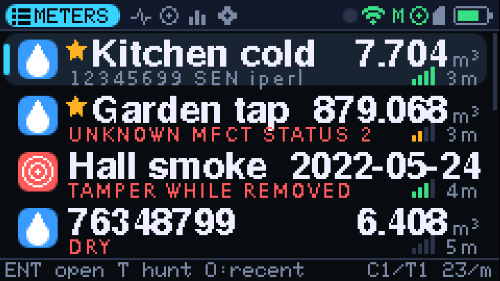
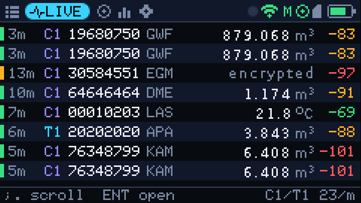
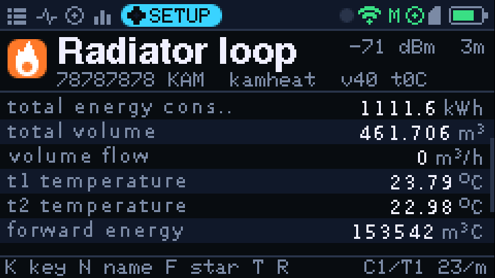
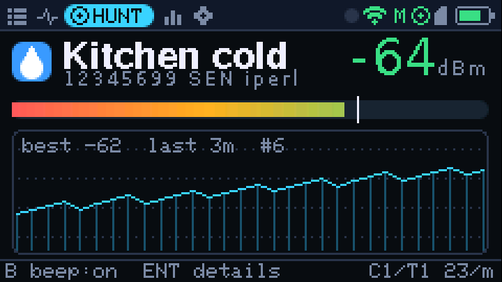
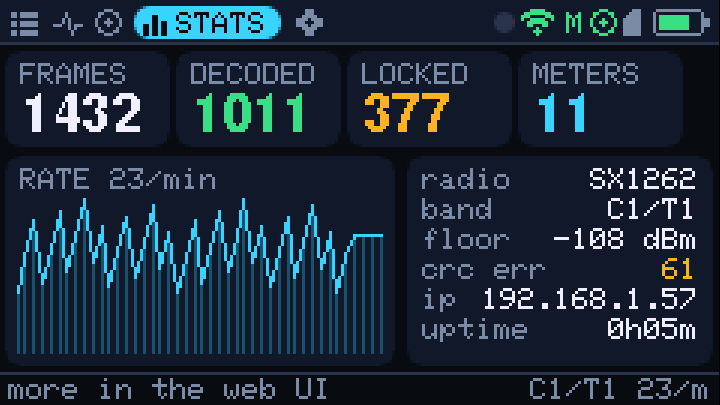
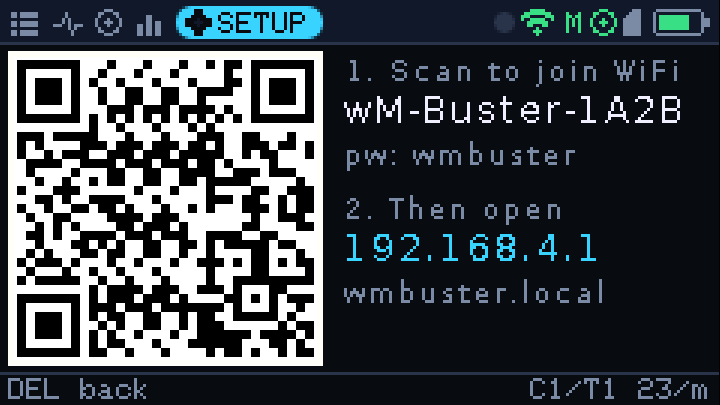

# wM-Buster ADV

Wireless M-Bus receiver and decoder firmware for the **M5Stack Cardputer-ADV**.
It listens for water, heat, electricity, gas, heat-cost-allocator, smoke and room
sensor telegrams (EN 13757-4 **C1, T1 and S1**), decrypts them, decodes them on the
device with a full port of the [wmbusmeters](https://github.com/wmbusmeters/wmbusmeters)
driver engine, and shows the results on the Cardputer, in a web UI, over MQTT
(with Home Assistant discovery), on the USB serial port and in SD card logs.

| | | |
|---|---|---|
|  |  |  |
|  |  |  |

## Highlights

* **All 122 wmbusmeters XMQ drivers, decoded exactly like upstream.** The engine is a
  faithful port: DIF/VIF records, storage/tariff/subunit matching, combinables,
  lookups, unit-aware formulas, ixml grammars for manufacturer payloads, compact
  frames and compact profiles (history values). The upstream driver test suite runs on
  the host: **385 of 385 test telegrams decode to the same fields and values**.
* **Every common security mode.** AES-128 CBC (mode 5), AES CBC with CMAC key
  derivation (mode 7), AES-CCM (mode 10, OMS profile D), ELL AES-CTR, DES (modes 2/3),
  Diehl IZAR/PRIOS LFSR, Qundis walk-by blocks and driver default keys.
  Meters without a driver still get a generic OMS decode.
* **Much better reception.**
  * SX1262 (Cap LoRa-1262): the antenna switch is actually enabled (the PI4IOE
    expander was misconfigured before, costing ~30 dB). Boosted RX gain, a 234 kHz
    filter and an 8-bit preamble detector are used. A sync word interrupt starts a
    timed read, so reception stops right after each frame and false syncs are
    dropped in well under a millisecond.
  * CC1101 (Hydra RF): infinite packet mode with FIFO streaming. Earlier builds cut
    every frame at 61 bytes.
  * T1 (3-out-of-6), C1 frame A and B, and S1 (Manchester) are supported. You can
    also alternate between the 868.95 MHz and 868.30 MHz bands.
  * A dedicated high-priority radio task and a capture queue, so UI, Wi-Fi and SD
    card work never make the receiver miss a telegram.
* **A new user interface**: meter list with values, signal and age, a live feed, a
  **Hunt** mode (signal gauge, history graph and proximity beeps) to find a meter,
  statistics, on-device settings, and meter keys typed on the keyboard. A QR code
  connects your phone to the web UI. Four themes are included.
* **Web UI** on the device's own access point or your network. It shows the live
  feed, sortable and filterable meters, full decodes, a telegram analyzer, key
  management, settings, log downloads and firmware updates over the air.
  It needs no internet access.
* **MQTT** with credentials, 4 KB messages, wmbusmeters-compatible JSON, last will,
  and Home Assistant discovery with proper units and device and state classes.
* **USB serial** in three output modes:
  * readable log lines;
  * JSON;
  * `rtl_wmbus` lines that a PC wmbusmeters can use directly.

  There's also a command line for keys, bands and analysis.
* **SD card logs**: replayable raw telegrams, decoded JSON lines and a wardriving
  CSV with GNSS positions. Meter keys are imported from `/keys.txt` at boot.
* **GNSS** (Cap LoRa-1262) provides positions per meter (GeoJSON export in the web
  UI) and sets the clock without network.

## Hardware

* [M5Stack Cardputer-ADV](https://docs.m5stack.com/en/core/Cardputer-Adv)
* one radio cap, auto-detected at boot:
  * **Cap LoRa-1262** (SX1262 + GNSS), recommended
  * **Hydra RF** (CC1101). Use an 868 MHz tuned board; a 433 MHz board attenuates
    868 MHz heavily.
* optional: microSD card (FAT32)

## Install

Download `wmbuster-adv-full.bin` and flash it at offset **0x0**, for example with
the [esptool-js web flasher](https://espressif.github.io/esptool-js/) or:

```bash
esptool.py --chip esp32s3 write_flash 0x0 wmbuster-adv-full.bin
```

Later updates can be uploaded in the web UI (Settings → Firmware update, use
`firmware.bin`).

## Getting started

1. Power on. The splash screen shows the detected radio and band.
2. Meters appear on the **METERS** tab as their telegrams arrive. Encrypted meters
   show a lock.
3. Open **SETUP → Connect phone (QR)**. Scan the first code to join the
   `wM-Buster-XXXX` access point (password `wmbuster`), then open
   `http://192.168.4.1`.
4. Add keys for your meters: on the device (open the meter, press **K** and type
   the 32 hex digits), in the web UI (click a meter), over serial
   (`key 12345678 00112233445566778899AABBCCDDEEFF`), or with `/keys.txt` on the SD
   card:

   ```text
   # id,key,name,driver   (key NOKEY for none, driver "auto" to detect)
   12345678,00112233445566778899AABBCCDDEEFF,Kitchen water,auto
   ```

   wmbusmeters meter files (`name=`, `id=`, `key=`, `driver=` lines) work too.
   Keys are stored in flash (NVS).

### Keys on the device

| Key | Action |
|---|---|
| `Tab`, `1`–`5` | switch view: Meters, Live, Hunt, Stats, Setup |
| `;` `.` (↑ ↓) | move / scroll (hold to repeat) |
| `,` `/` (← →) | previous / next view, change a setting |
| `Enter` | open meter / change setting |
| `Del` | back / erase |
| `` ` `` | cancel text entry |
| `T` | hunt the selected meter (proximity beeps, `B` toggles) |
| `F` or `*` | star / unstar (starred meters stay on top and trigger ntfy alerts) |
| `O` | meter sort order: recent, signal, id, count |
| `K`, `N`, `R` | in a meter: enter key, name, raw telegram |

## Integrations

**Home Assistant / MQTT.** Enable MQTT in the web UI and set the broker, user and
password. Telegrams go to `wmbusmeters/<name or id>` in the same JSON format that
wmbusmeters produces. Meters you configured (name, key or star) get Home Assistant
discovery entities automatically. `wmbusmeters/wmbuster/status` carries
online/offline, and `wmbusmeters/wmbuster/state` has statistics.

**A PC running wmbusmeters.** Set the serial output to `rtl_wmbus` and use the
Cardputer as its receiver:

```bash
stty -F /dev/ttyACM0 115200 raw
wmbusmeters --format=json stdin:rtlwmbus MyMeter auto 12345678 NOKEY < /dev/ttyACM0
```

SD logs replay the same way:
`wmbusmeters stdin:rtlwmbus < telegrams.rtl`.

**ntfy.** Set an ntfy URL (for example `https://ntfy.sh/my-topic`) to get pushed
notifications when a starred meter is first heard or its status changes (leak,
tamper, ...).

**Serial commands.** Type `help`. You can paste any hex telegram to analyze it,
or use `analyze <hex> <key> <driver>`, `meters`, `show <id>`,
`band ct|s|hop`, `out log|json|rtlwmbus`, `wifi <ssid> <pass>`,
`mqtt <host> [port] [user] [pass]`, `stats`.

## Building

```bash
pio run -e m5stack-cardputer-adv              # firmware + wmbuster-adv-full.bin
pio run -e m5stack-cardputer-adv -t upload    # flash over USB
```

`web/index.html` is gzipped into the firmware automatically at build time.

### Tests without hardware

```bash
make -C test/host          # 204 unit checks + all upstream wmbusmeters driver tests
make -C test/ui_preview    # renders every screen of the device UI to PNG
```

The analyzer is also available on the PC: `make -C test/host analyze &&
test/host/build/analyze <hex> [driver|auto] [key]`.

### Updating the drivers

The drivers, manufacturer names and test vectors are generated from a wmbusmeters
checkout:

```bash
python3 tools/generate_drivers.py /path/to/wmbusmeters
```

## Layout

```text
lib/wmbus/      portable decoder library: frames, telegram layers + crypto,
                DIF/VIF, driver engine, formulas, ixml, generated drivers
lib/radio/      SX1262 / CC1101 receiver task
src/app/        pipeline, meter table, settings/keys, console, SD logging
src/net/        WiFi, web UI + JSON API, MQTT, ntfy
src/ui/         on-device UI (hardware independent view + Cardputer glue)
src/hw/         board (RF switch, LED, battery) and GNSS
web/            web UI source
test/           host tests, UI preview, upstream test vectors
tools/          driver generator, web embedding, merged image
```

## Credits

[wmbusmeters](https://github.com/wmbusmeters/wmbusmeters) by Fredrik Öhrström and
contributors. The decoder engine, drivers and test telegrams come from there.
The CC1101 and SX1262 settings follow the esphome wmbus components by
SzczepanLeon and contributors.

## License

GPL-3.0.
